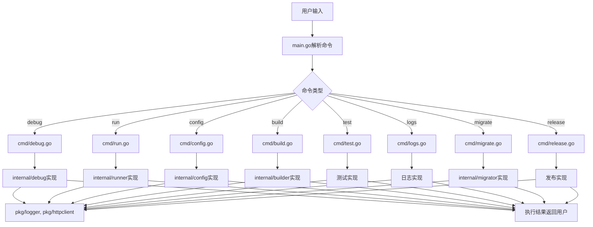
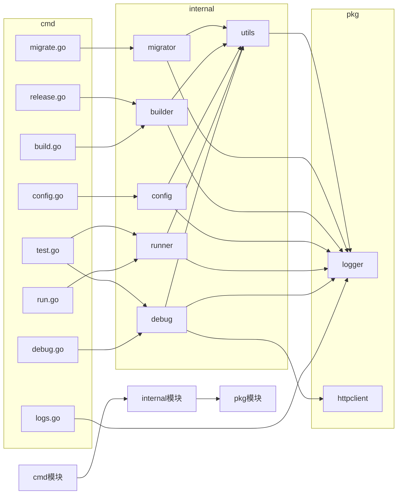
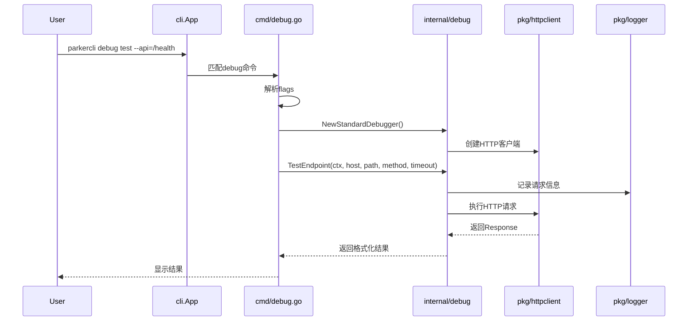
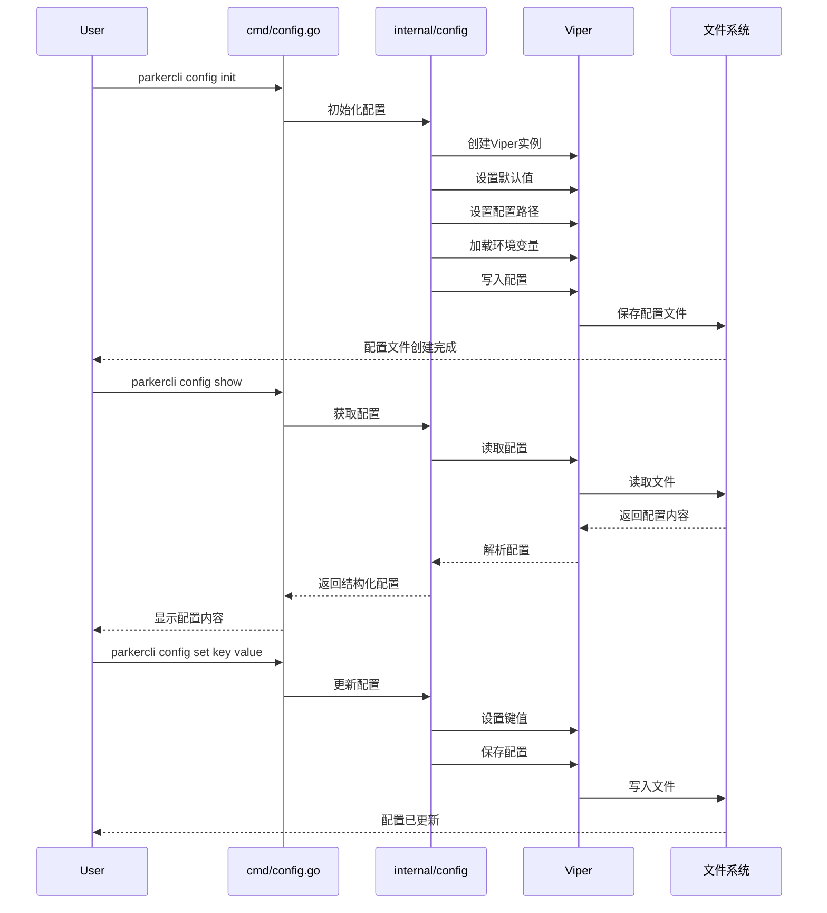
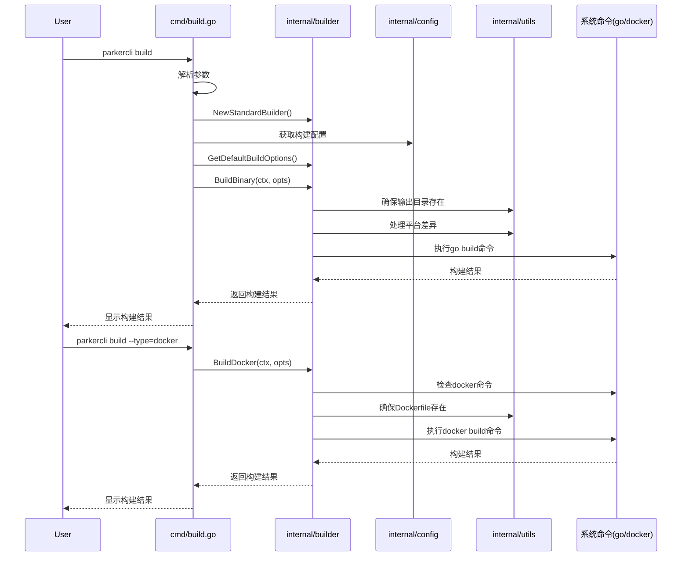
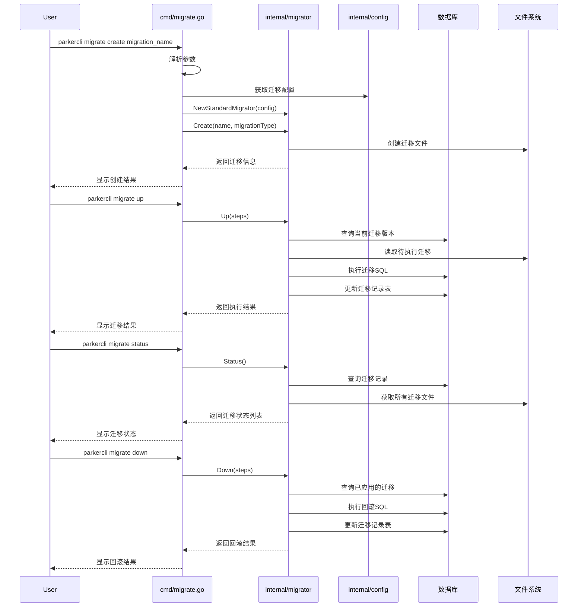
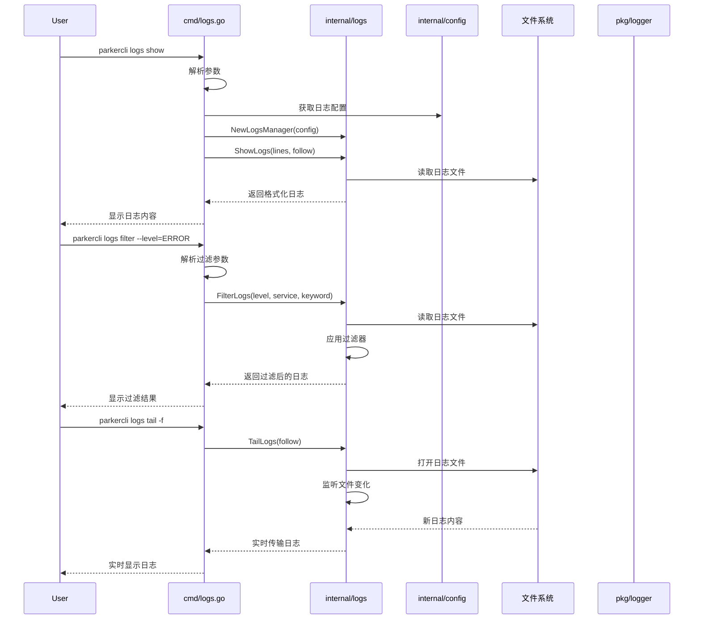
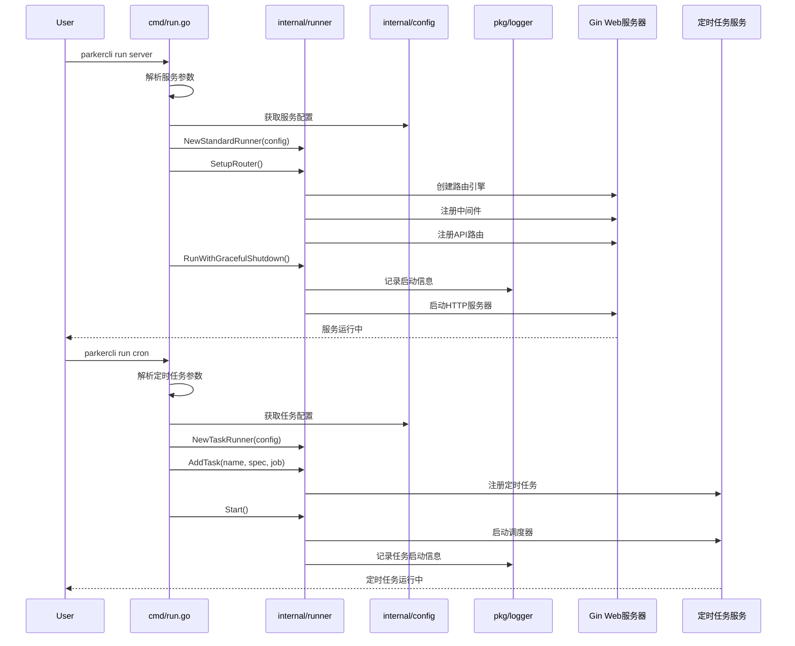
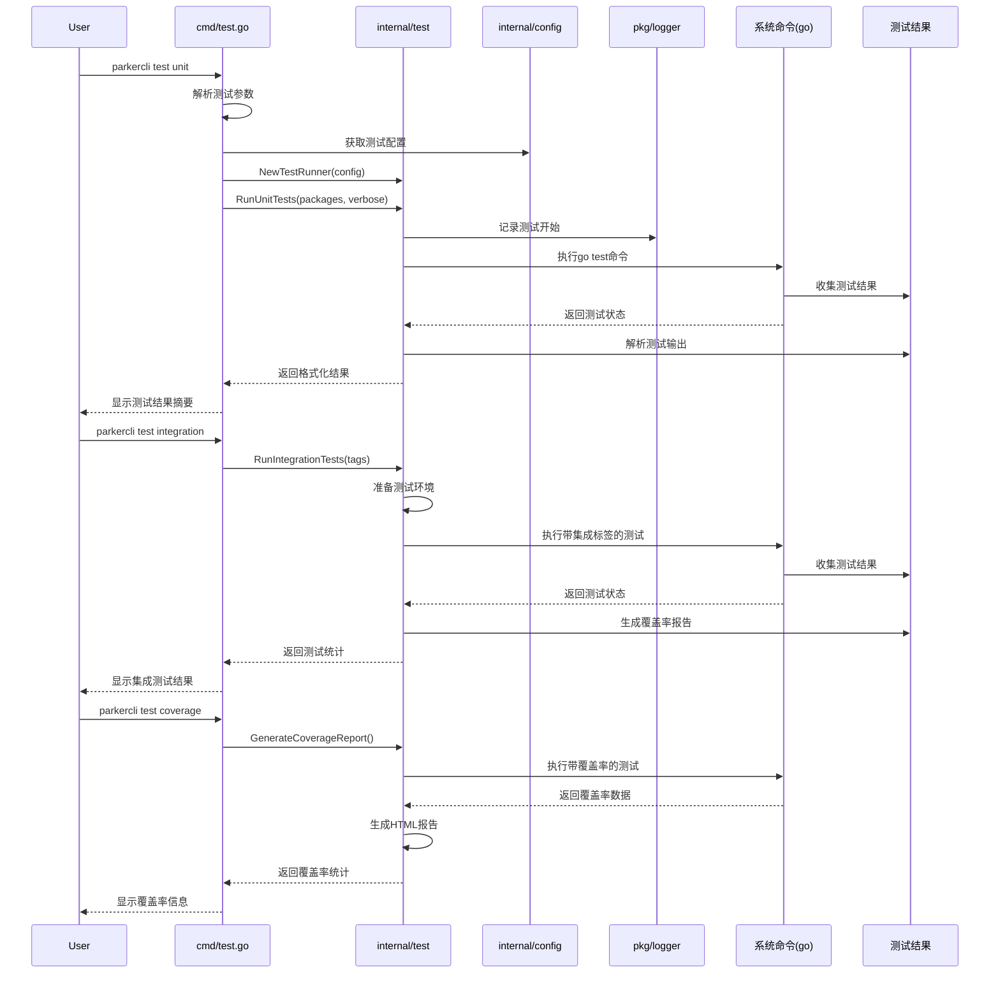
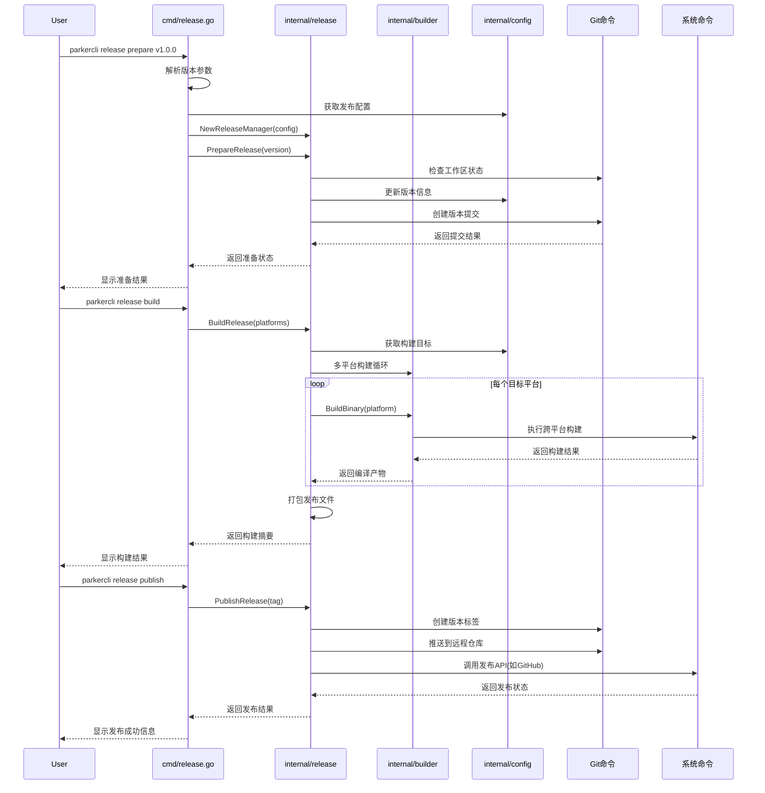

# ParkerCli 项目架构设计

## 概述

ParkerCli是一款面向Go后端开发的一站式命令行工具，基于urfave/cli框架构建，涵盖了开发、调试、构建、发布等全流程功能。本文档详细说明项目的架构设计、模块划分和核心实现理念。

## 项目整体结构

```
ParkerCli/
├─ cmd/               # 命令定义与处理
│  ├─ debug.go        # 调试命令
│  ├─ run.go          # 运行命令
│  ├─ config.go       # 配置命令
│  ├─ build.go        # 构建命令
│  ├─ test.go         # 测试命令
│  ├─ logs.go         # 日志命令
│  ├─ migrate.go      # 迁移命令
│  └─ release.go      # 发布命令
├─ internal/          # 内部业务逻辑
│  ├─ config/         # 配置管理
│  ├─ debug/          # 调试工具
│  ├─ runner/         # 服务运行器
│  ├─ migrator/       # 数据库迁移
│  ├─ builder/        # 构建工具
│  └─ utils/          # 通用工具函数
├─ pkg/               # 可重用公共库
│  ├─ logger/         # 日志库
│  └─ httpclient/     # HTTP客户端
├─ test/              # 测试相关
│  ├─ fixtures/       # 测试数据
│  └─ mocks/          # 模拟对象
├─ docs/              # 文档
│  ├─ developLog.md          # 开发日志
│  ├─ developProcess.md      # 开发流程
│  ├─ project_architecture.md # 项目架构文档
│  └─ docV1.0.md             # 功能文档
├─ scripts/           # 辅助脚本
├─ migrations/        # 迁移文件存储
├─ .gitignore         # Git忽略文件
├─ go.mod             # Go模块定义
├─ go.sum             # 依赖校验和
├─ main.go            # 程序入口
└─ README.md          # 项目说明
```

## 架构设计原则

ParkerCli的架构设计遵循以下核心原则：

1. **模块化设计**：每个命令和功能都被设计成独立模块，便于维护和扩展。
2. **关注点分离**：命令定义(cmd/)与具体实现(internal/)分离，提高代码的可测试性。
3. **一致性体验**：所有命令遵循统一的使用方式和风格，减少用户学习成本。
4. **扩展性优先**：系统设计为可扩展的，新功能可以容易地集成而不影响现有功能。
5. **最佳实践**：遵循Go语言的惯例和最佳实践，如包的组织、错误处理等。

## 核心模块详解

### 1. 命令模块 (cmd/)

命令模块包含所有CLI命令的定义、参数设置和帮助信息，每个命令文件导出一个对应的命令变量供main.go注册。

```go
// 典型命令定义结构
var XxxCommand = &cli.Command{
    Name:  "xxx",
    Usage: "xxx相关操作",
    Subcommands: []*cli.Command{
        {
            Name:  "sub",
            Usage: "xxx子命令",
            Flags: []cli.Flag{
                &cli.StringFlag{Name: "param", Usage: "参数说明"},
            },
            Action: xxxSubAction,
        },
    },
}

// 处理函数通常定义在同文件中
func xxxSubAction(c *cli.Context) error {
    // 调用internal/中的具体实现
    return nil
}
```

### 2. 内部逻辑模块 (internal/)

内部模块包含各命令的具体业务逻辑实现，按功能领域分组：

- **config/**：使用Viper实现配置文件的读写和管理
- **debug/**：实现调试相关功能，如日志分析、HTTP请求测试
- **runner/**：集成Gin框架，管理Web服务和定时任务的生命周期
- **migrator/**：实现数据库迁移逻辑，版本跟踪和回滚
- **builder/**：处理Go代码编译和Docker镜像构建

### 3. 公共库 (pkg/)

可在项目内外重用的通用功能，具有稳定API：

- **logger/**：封装结构化日志库，提供统一的日志接口
- **httpclient/**：封装HTTP客户端，支持超时、重试等高级功能

### 4. 程序入口 (main.go)

主程序负责注册所有命令并启动CLI应用：

```go
func main() {
    app := &cli.App{
        Name:    "ParkerCli",
        Usage:   "一款面向 Go 后端开发调试、部署、发布的全能 CLI 工具",
        Version: "0.1.0",
        Commands: []*cli.Command{
            cmd.DebugCommand,
            cmd.RunCommand,
            // 其他命令...
        },
    }

    if err := app.Run(os.Args); err != nil {
        log.Fatal(err)
    }
}
```

## 命令流程与架构

### 命令处理流程

1. 用户输入命令 `./ParkerCli xxx sub --param=value`
2. main.go中注册的cli.App解析命令行参数
3. 匹配到对应的命令和子命令(cmd/xxx.go中定义)
4. 执行关联的Action函数(xxxSubAction)
5. Action函数调用internal/中的具体实现逻辑
6. 返回结果或错误给用户

### 错误处理策略

- 使用装饰器模式对错误进行分类和包装
- 不同级别的错误有不同的显示方式
- 用户错误(如参数错误)提供友好提示和修复建议
- 系统错误提供详细日志方便调试

### 配置管理

- 使用Viper库处理多种格式的配置文件(YAML, JSON, TOML)
- 支持配置的多层级展示和查询
- 配置更改自动持久化

## 扩展机制

ParkerCli设计了灵活的扩展机制，便于添加新功能：

1. **新增命令**：
   - 在cmd/目录创建新命令文件
   - 定义命令结构和子命令
   - 在main.go中注册新命令

2. **扩展内部功能**：
   - 在internal/目录添加新的功能模块
   - 在cmd/中的命令调用新功能

## 测试策略

- **单元测试**：测试各模块的核心功能
- **集成测试**：测试命令的端到端行为
- **模拟测试**：使用mock替代外部依赖
- **测试数据**：在test/fixtures/中提供测试数据

## 性能考量

- 命令启动速度优化，避免不必要的初始化
- 大型操作(如构建)支持缓存机制
- 耗时操作提供进度反馈

## 兼容性与跨平台

- 使用跨平台API，避免系统特定代码
- Windows环境特别处理（如路径分隔符、命令执行）
- 输出格式适应不同终端特性

## 后续演进方向

1. **插件系统**：支持第三方扩展
2. **远程执行**：支持在远程服务器执行命令
3. **Web界面**：提供可视化管理界面
4. **云平台集成**：支持主流云平台API

## 依赖库选择理由

- **urfave/cli/v2**：功能丰富、文档完善的CLI框架，支持命令嵌套和丰富的参数类型
- **gin-gonic/gin**：高性能Web框架，适合构建API服务
- **spf13/viper**：灵活的配置管理库，支持多种配置源
- **robfig/cron/v3**：强大的定时任务库，支持crontab语法
- **docker/docker**：官方Docker API，提供容器操作能力

通过以上架构设计，ParkerCli实现了功能模块化、易扩展、易测试的特性，为Go后端开发者提供了一站式的开发工具链。 

## 流程图与函数关系

### 命令执行流程图



### 模块依赖关系图



### debug命令调用流程



### 配置管理流程



### 构建流程



### 迁移流程



### 日志管理流程



### 服务运行流程



### 测试流程



### 发布流程



### 接口实现关系

```mermaid
classDiagram
    class Logger {
        <<interface>>
        +Debug(format string, args ...interface{})
        +Info(format string, args ...interface{})
        +Warn(format string, args ...interface{})
        +Error(format string, args ...interface{})
        +Fatal(format string, args ...interface{})
        +SetLevel(level LogLevel)
        +SetOutput(w io.Writer)
    }
    
    class StandardLogger {
        -level LogLevel
        -output io.Writer
        +Debug(format string, args ...interface{})
        +Info(format string, args ...interface{})
        +Warn(format string, args ...interface{})
        +Error(format string, args ...interface{})
        +Fatal(format string, args ...interface{})
        +SetLevel(level LogLevel)
        +SetOutput(w io.Writer)
    }
    
    class HTTPTester {
        <<interface>>
        +TestEndpoint(ctx context.Context, host, path, method string, timeout int) (*Response, error)
    }
    
    class StandardDebugger {
        -httpClient *HTTPClient
        +TestEndpoint(ctx context.Context, host, path, method string, timeout int) (*Response, error)
        +GetLogs(level string) ([]string, error)
        +GetSystemInfo() (map[string]interface{}, error)
    }
    
    class Builder {
        <<interface>>
        +BuildBinary(ctx context.Context, opts BuildOptions) (*BuildResult, error)
        +BuildDocker(ctx context.Context, opts BuildOptions) (*BuildResult, error)
    }
    
    class StandardBuilder {
        +BuildBinary(ctx context.Context, opts BuildOptions) (*BuildResult, error)
        +BuildDocker(ctx context.Context, opts BuildOptions) (*BuildResult, error)
    }
    
    class MigrationService {
        <<interface>>
        +Create(name string, migrationType MigrationType) (*Migration, error)
        +Up(steps int) error
        +Down(steps int) error
        +Status() ([]Migration, error)
        +Reset() error
        +Refresh() error
        +Generate(name, template string) (*Migration, error)
    }
    
    class StandardMigrator {
        -migrationsDir string
        -schemaTable string
        -dbDriver string
        -dbDSN string
        +Create(name string, migrationType MigrationType) (*Migration, error)
        +Up(steps int) error
        +Down(steps int) error
        +Status() ([]Migration, error)
        +Reset() error
        +Refresh() error
        +Generate(name, template string) (*Migration, error)
    }
    
    class ServerRunner {
        <<interface>>
        +SetupRouter() *gin.Engine
        +AddRoutes(router *gin.Engine)
        +Run(ctx context.Context) error
        +RunWithGracefulShutdown() error
    }
    
    class TaskRunner {
        <<interface>>
        +AddTask(name string, spec string, job JobFunc, opts TaskOptions) (cron.EntryID, error)
        +RemoveTask(id cron.EntryID)
        +Start()
        +Stop()
        +RunOnce(name string) error
    }
    
    class StandardRunner {
        -server *http.Server
        -router *gin.Engine
        -cronRunner *cron.Cron
        -tasks map[string]JobFunc
        -taskOpts map[string]TaskOptions
        -serverOpts ServerOptions
        +SetupRouter() *gin.Engine
        +AddRoutes(router *gin.Engine)
        +Run(ctx context.Context) error
        +RunWithGracefulShutdown() error
        +AddTask(name string, spec string, job JobFunc, opts TaskOptions) (cron.EntryID, error)
        +RemoveTask(id cron.EntryID)
        +Start()
        +Stop()
        +RunOnce(name string) error
    }
    
    class LogsManager {
        <<interface>>
        +ShowLogs(lines int, follow bool) ([]LogEntry, error)
        +FilterLogs(level, service, keyword string) ([]LogEntry, error)
        +TailLogs(follow bool) (*LogStream, error)
    }
    
    class StandardLogsManager {
        -logFilePath string
        -maxLines int
        +ShowLogs(lines int, follow bool) ([]LogEntry, error)
        +FilterLogs(level, service, keyword string) ([]LogEntry, error)
        +TailLogs(follow bool) (*LogStream, error)
    }
    
    class TestRunner {
        <<interface>>
        +RunUnitTests(pkgs []string, verbose bool) (*TestResult, error)
        +RunIntegrationTests(tags []string) (*TestResult, error)
        +GenerateCoverageReport() (*CoverageReport, error)
    }
    
    class StandardTestRunner {
        -projectRoot string
        -testTimeout time.Duration
        -coverageThreshold float64
        +RunUnitTests(pkgs []string, verbose bool) (*TestResult, error)
        +RunIntegrationTests(tags []string) (*TestResult, error)
        +GenerateCoverageReport() (*CoverageReport, error)
    }
    
    class ReleaseManager {
        <<interface>>
        +PrepareRelease(version string) error
        +BuildRelease(platforms []string) (*ReleaseArtifacts, error)
        +PublishRelease(tag string) error
    }
    
    class StandardReleaseManager {
        -builder Builder
        -config Config
        -outputDir string
        -releaseRepo string
        +PrepareRelease(version string) error
        +BuildRelease(platforms []string) (*ReleaseArtifacts, error)
        +PublishRelease(tag string) error
    }
    
    Logger <|.. StandardLogger
    HTTPTester <|.. StandardDebugger
    Builder <|.. StandardBuilder
    MigrationService <|.. StandardMigrator
    ServerRunner <|.. StandardRunner
    TaskRunner <|.. StandardRunner
    LogsManager <|.. StandardLogsManager
    TestRunner <|.. StandardTestRunner
    ReleaseManager <|.. StandardReleaseManager
```

通过以上流程图和函数关系图，可以更清晰地了解ParkerCli的整体架构和各模块间的交互关系。这种可视化的方式有助于新开发者快速理解项目结构，也便于在后续开发中保持架构的一致性和延续性。